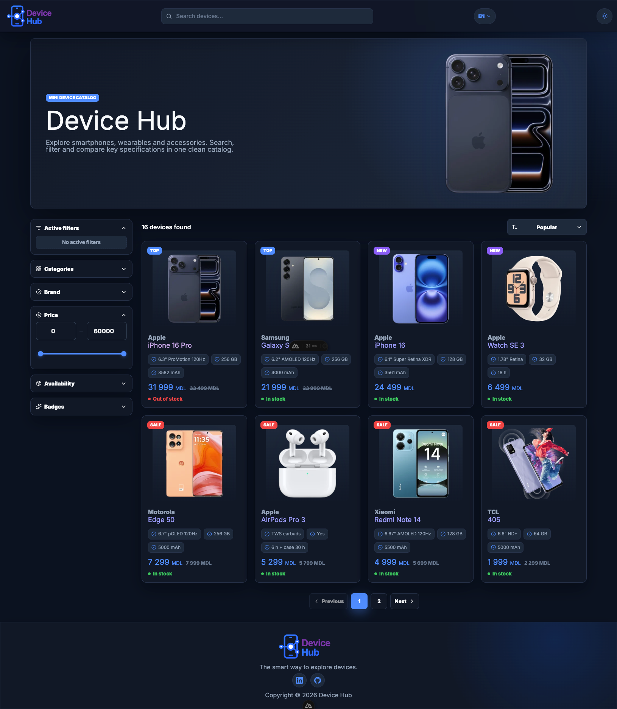
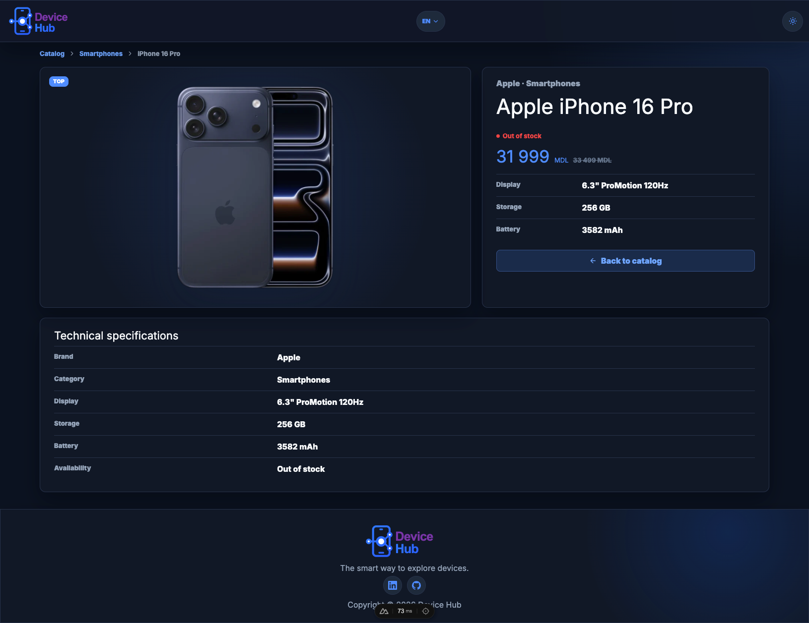
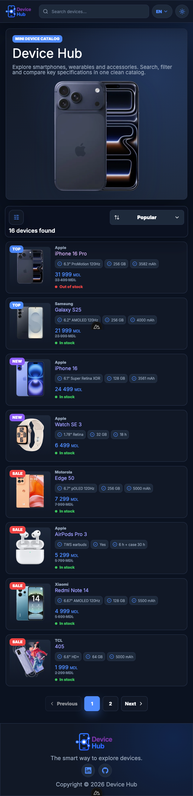
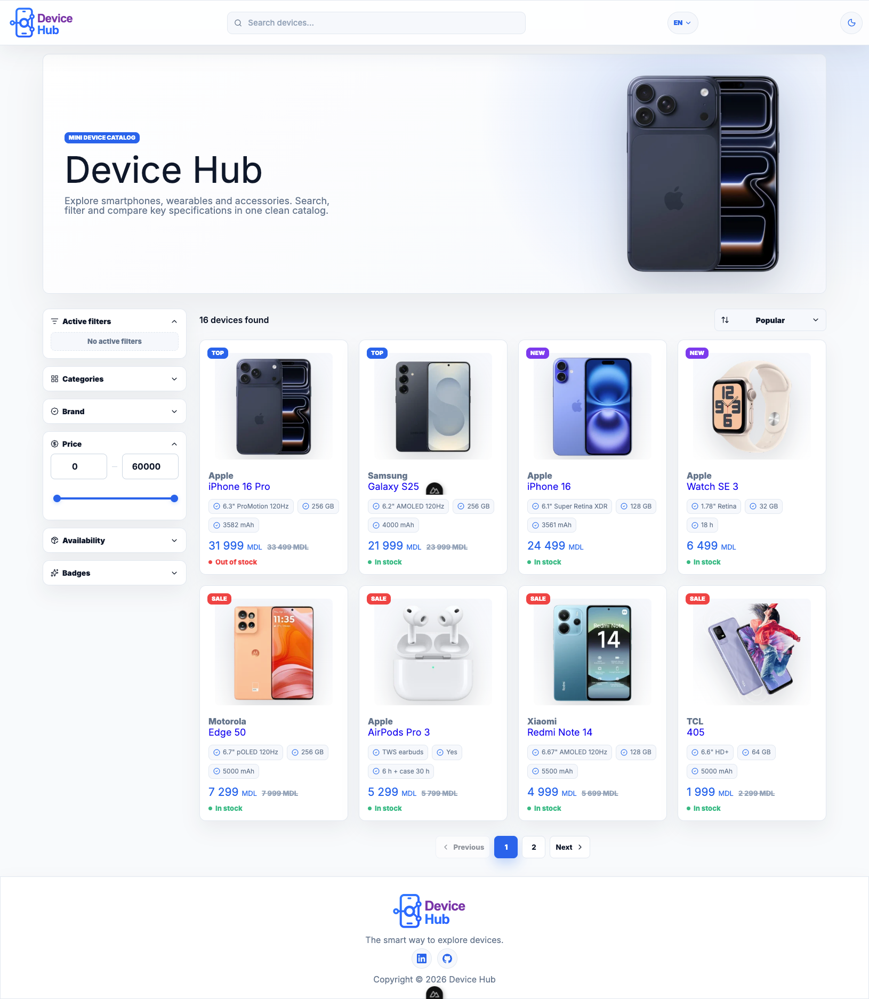
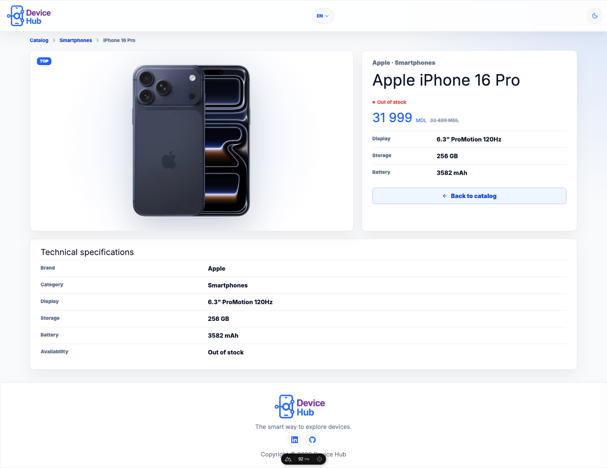
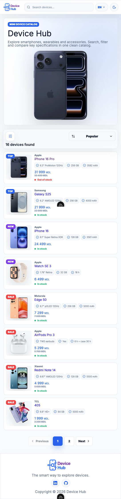

# Device-hub

Device-hub is a clean and user-friendly website for exploring electronic devices. It allows users to browse products, check prices and availability, view main specifications, and quickly find the right device using filters and search.

Application built with **Nuxt** and **Vue**.

## Screenshots

<table>
  <tr>
    <td>
      
    </td>
    <td>
      
    </td>
    <td>
      
    </td>
  </tr>
  <tr>
    <td>
      
    </td>
    <td>
      
    </td>
      <td>
      
    </td>
  </tr>
</table>

---

## 📦 Used Packages

- [Nuxt](https://nuxt.com/) – Vue framework for building full-stack web applications
- [Vue](https://vuejs.org/) – Progressive frontend framework
- [TypeScript](https://www.typescriptlang.org/) – Strongly typed JavaScript for safer and more maintainable code
- [Zod](https://zod.dev/) – TypeScript-first schema validation for API data and query parameters
- [Vue Router](https://router.vuejs.org/) – Routing library used by Nuxt for page navigation
- [Nuxt Image](https://image.nuxt.com/) – Image optimization module
- [Nuxt Icon](https://github.com/nuxt/icon) – Icon module for Vue/Nuxt components
- [Nuxt Google Fonts](https://google-fonts.nuxtjs.org/) – Google Fonts integration
- [Prettier](https://prettier.io/) – Code formatting tool
- [Nuxt i18n](https://i18n.nuxtjs.org/) – Internationalization module for Nuxt

---

## 📁 Project Structure

```sh
/
├─ app/                         # Nuxt app source
│  ├─ assets/                   # Global styles and app assets
│  │  └─ css/
│  │     ├─ pages/              # Page-specific styles
│  │     │  ├─ device-detail.css
│  │     │  ├─ error.css
│  │     │  └─ index.css
│  │     ├─ main.css            # Base application styles
│  │     ├─ reset.css           # CSS reset
│  │     └─ variables.css       # CSS variables and theme tokens
│  ├─ components/               # Reusable Vue components
│  │  ├─ device/                # Device cards, skeletons and empty state
│  │  │  ├─ DeviceCard.vue
│  │  │  ├─ DeviceSkeleton.vue
│  │  │  └─ EmptyState.vue
│  │  ├─ filters/               # Catalog filter sidebar
│  │  │  └─ FilterSidebar.vue
│  │  ├─ filters-modal/         # Mobile filters modal
│  │  │  └─ FiltersModal.vue
│  │  ├─ hero/                  # Catalog hero section
│  │  │  └─ CatalogHero.vue
│  │  ├─ layout/                # Layout components
│  │  │  ├─ footer/
│  │  │  │  └─ SiteFooter.vue
│  │  │  └─ header/
│  │  │     └─ SiteHeader.vue
│  │  ├─ modal/                 # Base modal component
│  │  │  └─ Modal.vue
│  │  └─ ui/                    # Shared UI primitives
│  │     ├─ badge/
│  │     │  └─ AppBadge.vue
│  │     ├─ button/
│  │     │  └─ AppButton.vue
│  │     ├─ checkbox/
│  │     │  └─ AppCheckbox.vue
│  │     ├─ loader/
│  │     │  └─ AppLoader.vue
│  │     └─ price/
│  │        └─ AppPrice.vue
│  ├─ composables/              # Reusable Composition API logic
│  │  ├─ useDebouncedRef.ts     # Debounced reactive value helper
│  │  ├─ useDeviceFilters.ts    # Catalog filter state and URL sync
│  │  ├─ useDeviceI18n.ts       # Device/domain translation helpers
│  │  ├─ useTheme.ts            # Theme state and switching
│  │  └─ useWindowSize.ts       # Window size tracking
│  ├─ layouts/                  # Nuxt layouts
│  ├─ middleware/               # Nuxt route middleware
│  ├─ pages/                    # File-based routes
│  │  ├─ devices/
│  │  │  └─ [slug].vue          # Device details page
│  │  └─ index.vue              # Catalog page
│  ├─ utils/                    # App utility functions
│  ├─ app.vue                   # Root app component
│  └─ error.vue                 # Custom Nuxt error page
├─ i18n/                        # Localization files
│  └─ locales/
│     ├─ en.json
│     ├─ ro.json
│     └─ ru.json
├─ public/                      # Static public assets
│  ├─ img/                      # Device images
│  ├─ device-hub-logo.svg
│  ├─ favicon.ico
│  ├─ not-found.gif
│  └─ robots.txt
├─ server/                      # Nitro server code
│  ├─ api/                      # API routes
│  │  ├─ devices.get.ts         # Devices list endpoint
│  │  └─ devices/
│  │     └─ [slug].get.ts       # Device details endpoint
│  ├─ data/
│  │  └─ devices.ts             # Local devices dataset
│  └─ utils/
│     └─ data.ts                # Server data helpers
├─ shared/                      # Shared constants, schemas and types
│  ├─ constants/
│  │  ├─ device.constants.ts
│  │  └─ index.ts
│  ├─ schemas/
│  │  ├─ device.schema.ts
│  │  └─ index.ts
│  └─ types/
│     ├─ api.types.ts
│     ├─ device.types.ts
│     └─ index.ts
├─ nuxt.config.ts               # Nuxt configuration
├─ package.json                 # Scripts and dependencies
└─ tsconfig.json                # TypeScript configuration

This modular structure helps maintain a clean, scalable, and maintainable codebase.
```

---

## Setup

Make sure to install dependencies:

```bash
# npm
npm install
```

## Development Server

Start the development server on `http://localhost:3000`:

```bash
# npm
npm run dev
```

## Production

Build the application for production:

```bash
# npm
npm run build
```

Locally preview production build:

```bash
# npm
npm run preview
```

## 🧹 Reformat with [Prettier](https://prettier.io/)

```sh
bun prettier "src/**/*.{js,ts,vue}" --write --config .prettierrc

# For single file
bun prettier src/index.vue --write --config .prettierrc
```

---

## AI usage

Used chatGPT for:

1. Project name generation
2. Project description generation
3. Generation svg logo by project name
4. Generation of project structure for readme

---

## Limitations and Future Improvements

Due to the limited time available for this project, not all planned functionality could be fully implemented. The current version focuses on the core product catalog experience, including product listing, filtering, sorting, product cards, responsive layout, and basic UI structure.

Some additional features were planned but left for future development. Instead of adding unfinished or unstable functionality, the priority was to keep the existing implementation clean, logical, and maintainable.

### Planned Features

- **Shopping Cart**
  Add the ability for users to add products to a cart, update quantities, remove items, and view the total price before checkout.

- **Checkout and Payment Flow**
  Implement a complete checkout process with customer details, delivery information, order summary, and payment integration.

- **Favourites / Wishlist**
  Add a heart icon to product cards so users can save products they are interested in and access them later.

- **Product Compare**
  Allow users to compare several devices side by side based on price, specifications, availability, and key features.

- **Authentication**
  Add user registration, login, logout, and protected routes for personal account features.

- **User Profile**
  Create a profile page where users can manage their personal information, saved products, order history, and preferences.

- **Product Reviews**
  Add a review and rating system so users can share feedback and help others make better purchasing decisions.

- **Compatible Products**
  Display related or compatible products, such as accessories, headphones, watches, chargers, or other devices that work well with the selected product.

Overall, these features would make the project closer to a complete e-commerce platform. The next step would be to gradually implement them while keeping the codebase scalable, reusable, and easy to maintain.
